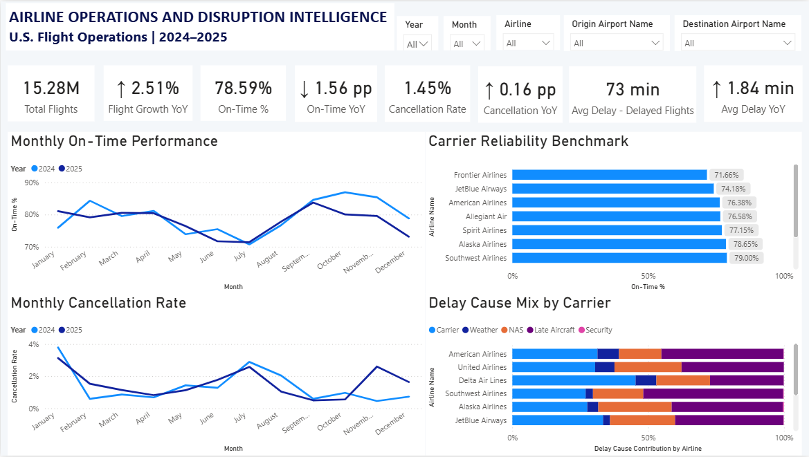
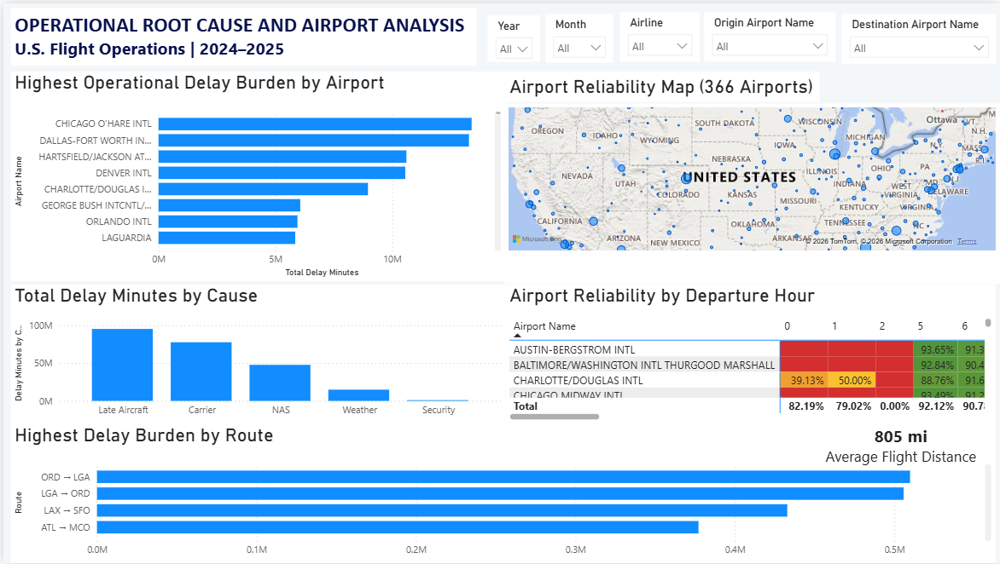
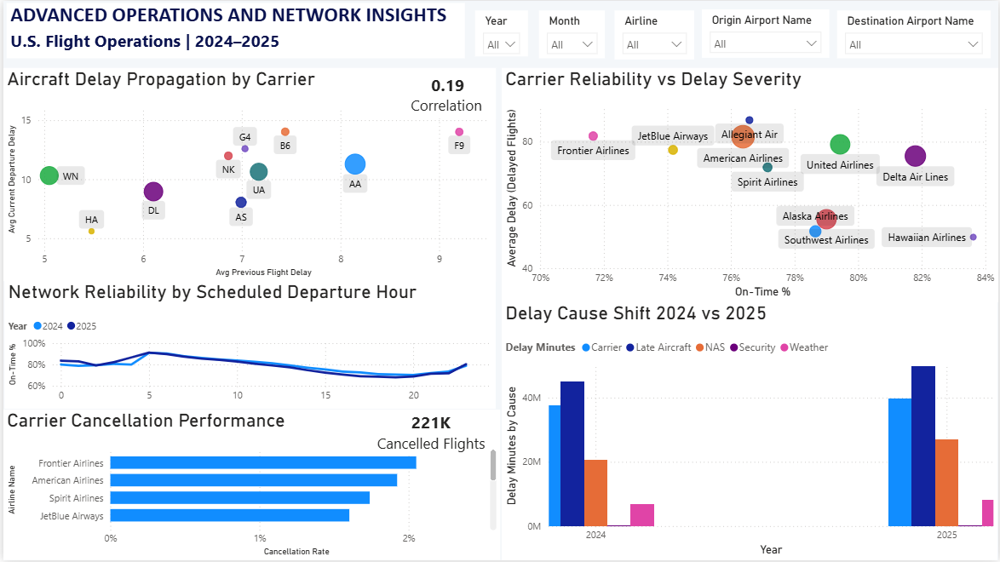

# Airline Operations & Disruption Analytics

An end-to-end airline operations analytics project built using **Python, Pandas, SQL (DuckDB), Power BI, Power Query, and DAX**, analyzing **15.28M+ U.S. flight records** from January 2024 through December 2025.

The project combines descriptive, diagnostic, and operational analytics to investigate airline reliability, airport performance, delay causes, route disruption, and aircraft-level delay propagation.

---

## Project Overview

Airline delays and cancellations have multiple interacting causes, including carrier operations, weather, air traffic constraints, and late-arriving aircraft.

This project analyzes flight-level operational data to answer:

- How did airline operational reliability change between 2024 and 2025?
- Which carriers and airports have the greatest operational disruption?
- Which delay causes contribute most to total delay?
- Which routes carry the greatest delay burden?
- Does a delay on an aircraft's previous flight relate to delay on its subsequent flight?

The final output is a three-page interactive Power BI dashboard supported by Python-based data ingestion, SQL analytical queries, and an enriched airport dataset.

---

## Key Results

The analysis covers:

- **15,283,738 flight records**
- **7,546,968 flights in 2024**
- **7,736,770 flights in 2025**
- **10.42M same-aircraft flight transitions** used for delay-propagation analysis

### 2024 → 2025 operational change

| Metric | 2024 | 2025 | Change |
|---|---:|---:|---:|
| Total Flights | 7,546,968 | 7,736,770 | **+2.51%** |
| On-Time Performance | 79.38% | 77.82% | **−1.56 pp** |
| Cancellation Rate | ~1.36% | ~1.53% | **~+0.17 pp** |
| Avg. Delay When Delayed | 72.15 min | 73.99 min | **+1.84 min** |

Despite higher flight volume in 2025, network reliability deteriorated across the primary operational KPIs.

---

## Delay Propagation Analysis

Aircraft-level sequencing was performed using the BTS `Tail_Number` identifier.

More than **10.4 million same-aircraft flight transitions** were analyzed to examine the relationship between:

**Previous flight arrival delay → Subsequent flight departure delay**

Results:

- Aircraft-flight transitions analyzed: **10,423,226**
- Transitions with previous-leg arrival delay ≥30 minutes: **6.49%**
- Subsequent flights delayed ≥15 minutes: **18.05%**
- Correlation between previous-leg arrival delay and subsequent departure delay: **0.1924**

The result indicates a **positive association** between previous-leg delay and subsequent departure delay. This analysis should not be interpreted as proof of causation.

---

## Technology Stack

### Data & Processing
- Python
- Pandas
- NumPy
- Parquet
- PyArrow

### SQL
- DuckDB
- SQL analytical queries over Parquet

### Business Intelligence
- Power BI Desktop
- Power Query
- DAX
- Star-schema data modeling

### Additional Data
- U.S. DOT BTS flight operations data
- FAA NTAD Aviation Facilities data

---

## Data Sources

### U.S. DOT Bureau of Transportation Statistics

The primary flight-level dataset is the:

**Marketing Carrier On-Time Performance (Beginning January 2018)**

The project uses monthly data from:

**January 2024 – December 2025**

The dataset contains flight dates, carrier information, airports, scheduled and actual operating times, cancellations, diversions, and delay-cause fields.

Source: https://www.transtats.bts.gov/

### FAA National Transportation Atlas Database

Airport metadata was enriched using the FAA NTAD Aviation Facilities dataset.

Selected attributes include:

- Airport ID
- Airport name
- City
- State
- Latitude
- Longitude
- Elevation
- Airport status
- Ownership type
- Facility/use information
- ICAO code

The airport metadata is used to enrich the Power BI airport dimensions and support geographic analysis.

---

## Data Pipeline

```text
BTS Monthly ZIP Files
        │
        ▼
Python / Pandas
        │
        ├── Extract CSV files
        └── Combine monthly datasets
        │
        ▼
Raw Parquet Dataset
        │
        ├───────────────────────┐
        │                       │
        ▼                       ▼
Power BI / Power Query       DuckDB SQL
        │                       │
        │                       ├── Carrier analysis
        │                       ├── Airport analysis
        │                       ├── Route analysis
        │                       ├── Delay-cause analysis
        │                       └── Year-over-year analysis
        │
        ▼
Star Schema + DAX
        │
        ▼
Interactive Power BI Dashboard A separate Python workflow generates the aircraft-level delay-propagation dataset.
```
## Power BI Data Model

The main flight table is modeled as a fact table:
```text
DimDate
│
│ 1:*
▼
DimAirline ───────► FactFlights ◄────── DimOriginAirport
▲
│
│ 1:*
│
DimDestinationAirport
```
### Fact table

**FactFlights**

Contains flight-level operational information including:

- carrier  
- flight number  
- tail number  
- origin and destination  
- scheduled and actual times  
- departure and arrival delays  
- cancellations  
- diversions  
- delay causes  
- distance and elapsed-time measures  

### Dimensions
- DimDate  
- DimAirline  
- DimOriginAirport  
- DimDestinationAirport  
- DimDelayCause  

Airport dimensions are enriched using FAA airport metadata.

---

## KPI Definitions

**On-Time Performance**  
A completed, non-diverted flight is classified as on time when the BTS arrival-delay indicator is not 15 minutes or more.
On-Time % = On-Time Completed Flights / Completed Flights
**Cancellation Rate**  
Cancellation Rate = Cancelled Flights / Total Flights

**Average Delay When Delayed**  
Average arrival delay among completed, non-diverted flights with an arrival delay of at least 15 minutes.

---

## Delay Causes

BTS provides delay minutes attributed to:

- Carrier  
- Weather  
- National Air System (NAS)  
- Security  
- Late Aircraft  
## Dashboard

The Power BI report contains three analytical pages.

### 1. Executive Overview

**Answers:**
- What happened across the network?

**Includes:**
- Total flights  
- Flight growth  
- On-time performance  
- Cancellation rate  
- Average delay when delayed  
- YoY performance indicators  
- Monthly on-time trends  
- Monthly cancellation trends  
- Carrier reliability benchmark  
- Delay-cause composition by carrier  

### 2. Operational Root Cause & Airport Analysis

**Answers:**
- Where is operational disruption concentrated, and what contributes to it?

**Includes:**
- Highest operational delay burden by airport  
- Airport reliability map  
- Total delay minutes by cause  
- Airport reliability by scheduled departure hour  
- Highest delay burden by route  

### 3. Advanced Operations & Network Insights

**Answers:**
- What operational patterns are associated with disruption?

**Includes:**
- Aircraft delay propagation by carrier  
- Carrier reliability vs. delay severity  
- Network reliability by scheduled departure hour  
- Delay-cause shift between 2024 and 2025  
- Carrier cancellation performance  
- Aircraft delay-propagation correlation  

---

## SQL Analytics

DuckDB is used as a lightweight analytical SQL layer directly over the Parquet dataset.

The SQL layer includes:
```text
sql/
├── 01_setup.sql
├── 02_carrier_analysis.sql
├── 03_airport_analysis.sql
├── 04_route_analysis.sql
├── 05_delay_cause_analysis.sql
└── 06_yoy_analysis.sql
```
The resulting analytical outputs are stored in: sql_outputs/

This provides an independent SQL-based validation layer for the Power BI metrics.

---

## Python Workflows

The Python directory contains scripts for:

- **download_bts.py**  
  Automates download of the monthly BTS datasets.

- **combine_bts.py**  
  Extracts and combines the monthly flight files into the raw Parquet dataset.

- **delay_propagation.py**  
  Constructs same-aircraft flight transitions and calculates previous-leg/subsequent-leg delay relationships.

- **delay_model.py**  
  Contains an exploratory CatBoost classification model for predicting whether a flight will experience an arrival delay of at least 15 minutes.

- **run_analyses.py**  
  Executes the SQL analysis scripts and produces CSV outputs.

---

## Predictive Modeling Experiment

A CatBoost model was explored as an additional predictive-analysis component.

**Target**  
- Arrival delay of at least 15 minutes.

**Predictive features**  
The initial experiment used only information available before the flight, including:
- Marketing carrier  
- Origin  
- Destination  
- Scheduled departure hour  
- Day of week  
- Month  
- Distance  
- Scheduled elapsed time  

The experiment used 2024 data for training and evaluated predictions on 2025.

**Initial result**  
- ROC-AUC: ~0.653
- Correlation: 0.19

The model showed predictive signal but was not included as a primary dashboard component because the initial classification threshold produced poor recall.  
The experiment is retained in the repository for future improvement.

---

## Key Analytical Insights

**Network reliability deteriorated in 2025**  
Flight volume increased by approximately 2.51%, while:
- On-time performance declined by 1.56 percentage points  
- Cancellation rate increased by approximately 0.17 percentage points  
- Average delay among delayed flights increased by 1.84 minutes  

This indicates that the additional operational volume was accompanied by weaker reliability.

**Delay causes can be analyzed both by composition and magnitude**  
The dashboard distinguishes between:
- delay-cause composition by carrier, and  
- absolute delay minutes by cause  

This prevents high-volume carriers and low-volume carriers from being compared solely on percentages.

**Previous-leg delays show positive downstream association**  
Across more than 10.4M same-aircraft transitions, previous arrival delay and subsequent departure delay showed a positive correlation of approximately 0.19.  
The result supports further investigation of aircraft rotation and turnaround performance.

## Limitations

- The analysis covers January 2024–December 2025 and does not attempt to model the COVID-era disruption period.  
- BTS delay-cause fields represent the agency's recorded delay attribution and should not be interpreted as a complete causal decomposition.  
- Delay propagation is an association analysis, not a causal model.  
- The propagation workflow currently focuses on same-day aircraft transitions.  
- Airport metadata comes from a separate FAA dataset and may not perfectly represent historical airport attributes for every flight date.  
- The initial predictive model was exploratory and is not presented as a production-grade delay prediction system.  

---

## Repository Structure
```text
airline-operations-disruption-analytics/
│
├── README.md
├── .gitignore
│
├── python/
│   ├── download_bts.py
│   ├── combine_bts.py
│   ├── delay_propagation.py
│   ├── delay_model.py
│   └── run_analyses.py
│
├── sql/
│   ├── 01_setup.sql
│   ├── 02_carrier_analysis.sql
│   ├── 03_airport_analysis.sql
│   ├── 04_route_analysis.sql
│   ├── 05_delay_cause_analysis.sql
│   └── 06_yoy_analysis.sql
│
├── sql_outputs/
│   ├── carrier_analysis.csv
│   ├── airport_analysis.csv
│   ├── route_analysis.csv
│   ├── delay_cause_analysis.csv
│   └── yoy_analysis.csv
│
├── powerbi/
│   ├── README.md
│   ├── page1_executive_overview.png
│   ├── page2_operational_analysis.png
│   └── page3_advanced_insights.png
│
└── data/
└── README.md
```

Large raw and processed datasets are excluded from version control because of their size.

---

## Reproduction

1. **Download the BTS data**  
   ```bash
   python python/download_bts.py
   ```
   The workflow is configured for January 2024 through December 2025

2. **Combine the monthly files**
   ```bash
   python python/combine_bts.py
   ```
   This produces the raw Parquet dataset used by the analytical workflows.

3. **Run the aircraft propagation analysis**
   ```bash
   python python/delay_propagation.py
   ```
   
4. **Run SQL analyses** 
   ```bash
   python python/run_analyses.py
   ```
   The resulting CSV outputs are stored in sql_outputs/.

5. **Open the Power BI report**
Open the Power BI Desktop report and connect it to the processed Parquet/analytical sources as described in the project workflow.

## Future Enhancements
Potential extensions include:

- Integrating historical weather observations

- Improving the delay-propagation methodology using airport time zones and cross-day rotations

- Expanding predictive modeling with aircraft-rotation and weather features

- Deploying the analytical layer to a cloud data warehouse such as Databricks

- Exposing operational analytics through a production BI environment
